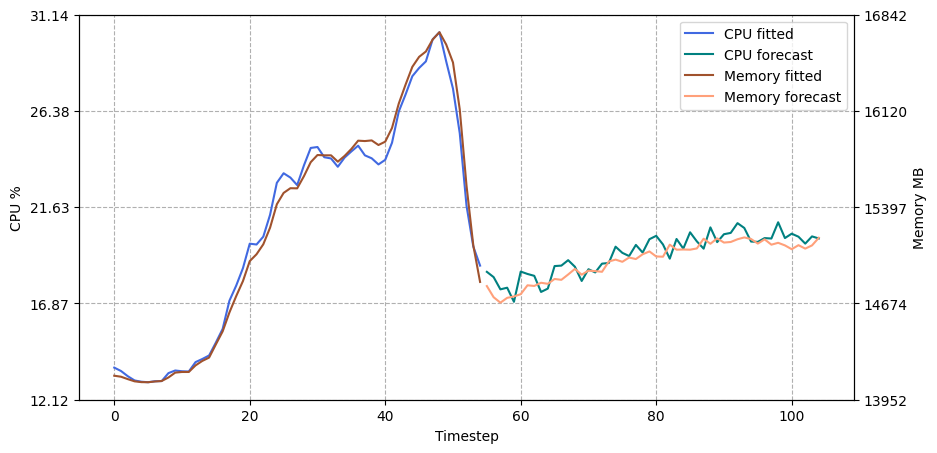

# sentinel_curve
A Windows resource monitoring and prediction tool. Collects real-time CPU and memory usage via C++, feeds it into a <a href="https://pytorch.org/">PyTorch</a> LSTM regression model, and forecasts future resource trends.

## Features
- Real-time CPU & memory monitoring via C++ on Windows
- LSTM regression model trained on collected time-series data
- Autoregressive future rollout with configurable steps and noise
- Seperate pipeline for the monitor & the training and inference loop
- Jupyter notebook for visualizing fitted & forecasted trends

## Prerequisites
- Windows
- C++ compiler
- Python 3.10+ 

## Usage
1. Run the pipeline:
    -   ```bash
        cd pipeline
        monitor.bat
        ```
    - This will create <code>data/data.csv</code> containing CPU (%) and memory (MB) usage.
    - Check out the [Arguments](#arguments)

2. Install requirements:
    -   ```bash
        pip install -r requirements.txt
        ```
    - <b>contains:</b>
        - Torch
        - Pandas
        - Numpy
        - Matplotlib
        - Scikit-learn
        - Pyyaml

3. Train the model & infer the results:
    - Model and inference parameters are located in <code>config.yaml</code>

    -   ```bash
        python -m pipeline.run
        ```
    - This will create <code>output/</code> which includes <code>model.pt</code> & <code>predictions.csv</code>

4. You can view your own results in <code>analysis.ipynb</code>:

    


## Arguments
You can customize how the monitor runs by passing arguments to <code>pipeline/monitor.bat</code>:

| Argument  | Default | Description |
|-----------|---------|-------------|
| <code>--interval</code> | 1 | Time interval (seconds) between each measurement |
| <code>--duration</code> | 60 | Total duration (seconds) to run the monitor |
| <code>--output</code> | <code>data/data.csv</code> | Path to the output CSV file where measurements are saved |

## License
MIT License
